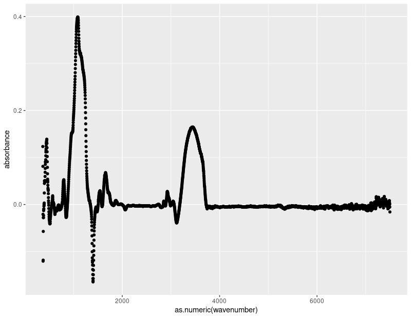
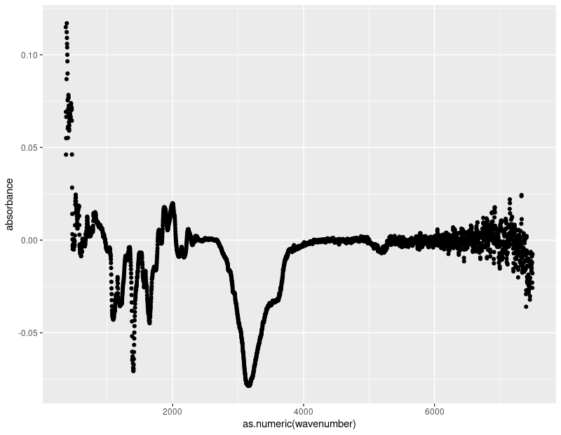

```{r setup, include = FALSE}
knitr::opts_knit$set(root.dir = "../../")
```
<!-- # Version -->

<!-- This Rmd-skeleton uses the mdpi Latex template published 2019/02.  -->
<!-- However, the official template gets more frequently updated than the 'rticles' -->
<!-- package. Therefore, please make sure prior to paper submission, that you're  -->
<!-- using the most recent .cls, .tex and .bst files  -->
<!-- (available [here](http://www.mdpi.com/authors/latex)). -->

# Introduction


Studying the content of biogenic silica and other organic compounds present in lake sediment cores can be a powerful tool in gaining insight into our reconstruction of past climates. The wet chemistry processes used to determine these proportions can be time consuming and costly. As a result, data on the amount of biogenic silica present in different samples is limited in quantity and resolution. Fourier-transform infrared (FTIR) spectroscopy is a promising technique to reduce the time and money needed to determine the proportion of these compounds in lake sediments. FTIR spectroscopy involves measuring the absorbance of the infrared radiation at different wavelengths. These absorbance values are arbitrary and unitless, so interpretation is needed to make them relevant between researchers. To interpret these absorbance values, we seek to use a Partial Least Squares Regression (PLSR) model to predict the percentage of the biogenic silica in each sample. This technique has been pioneered successfully by @vogel2008fourier, but is not accessible to those who might wish to use FTIR spectroscopy for their samples and lack the statistical background to implement a PLSR model. 
 
The goal of this project is to create an interface where a user can input their FTIR spectroscopy data into a PLSR model to calculate the approximate biogenic silica and total organic carbon percentages. Our work primarily includes improving the accuracy of the existing model (https://github.com/people-r-strange/PLSmodel) and preparing for universal input. This includes selection of the most applicable diagnostic plots to determine the accuracy of the model. Because this work will be accessible to the public, our model and corresponding interface satisfy an existing need for efficient FTIR spectroscopy interpretation. Further, greater accessibility and use of this technology may eliminate the need for expensive wet chemical processes. 

# Data

The model runs on spectroscopy data gathered from the analysis of lake bed samples. 26 samples are from Greenland, 100 are from Alaska, and two are specially made calibration samples. Each sample has two dimensions: a list of wavelengths tested, and a corresponding list of absorbance values measuring the sample’s absorbance of that specific wavelength of light (figure \ref{fig:fig1}). Each sample also has a single associated measurement of biogenic silica, calculated by traditional wet chemistry. 

```{r fig1, echo = FALSE, out.width= "85%", fig.cap = "Example showing two samples' absorbance values across the spectrum of wavelengths, illustrating the typical ranges of the spectrum for biogenic silica (BSi) and TOC (Total organic carbon).", fig.align='center'}
#knitr::include_graphics("paper_files/final_paper_draft/fig1.png")
```

The Greenland samples were tested at 3,697 wavelengths, from 368 cm^{-1} to 7497 cm^{-1}, while the Alaska samples were tested at 1,882 wavelengths from 368 cm^{-1} to 3996 cm^{-1}. The relationship between absorbance and wavelength is smooth for all samples between the wavelengths of 500 cm^{-1} and 4000 cm^{-1}, though below 500 cm^{-1} and above 4000 cm^{-1} the line shows increased noise, with the noise being the worst at the highest wavenumbers. This is evident in figure \ref{fig:fig2}, and even more notably in the higher wavenumbers of the wet quartz data in figure \ref{fig:fig3}. 

```{r fig2, echo = FALSE, out.width= "80%", fig.align='center', fig.cap = "The wavelength spectrum for a sample containing a high BSi content showing disruption of the smooth line of absorbance values below 500 $cm^{-1}$ and above 400 $cm^{-1}$."}
#
```

```{r fig3, echo = FALSE, out.width= "80%", fig.align='center', fig.cap = "The wavelength spectrum for a Wet Quartz sample containing a lower BSi content, which shows even more disruption of the smooth line below 500 $cm^{-1}$ and above 400 $cm^{-1}$."}
#
```

	The Greenland samples and the Alaskan samples were analyzed at different times with slightly different spectroscopy settings, so the wavelengths measured do not match exactly. The difference is small to the point of negligence, but the regression model requires the wavelength labels to be consistent. In addition, the Alaskan samples were analyzed on a much smaller range of wavelengths than the Greenland samples, though the resolution was about the same. To solve both problems at once, we linearly interpolate the absorbance curve from each Greenland sample to match the wavelengths of the Alaskan samples, as those do not vary. The absorbance curves from both samples were high enough resolution and the differences in wavelengths measured were small enough that we are comfortable that this did not meaningfully alter the data in any way, besides to make it all fit seamlessly in the same model. These minute differences in wavelengths is seen in figure \ref{fig:fig4}, where the interpolated data (red) is mapped on top of the original data (black). Since the black points are obscured behind the red dots, we see that the differences in wavenumbers is negligible. 

```{r fig4, echo = FALSE, out.width= "80%", fig.align='center', fig.cap = "Absorbance values shown across an interpolated wavelength spectrum (red) plotted on top of the absorbance values across the original empirical wavelength numbers (black). We only see a trace of the black beneath the red, indicating the accuracy of the interpolation of the high resolution data."}
#knitr::include_graphics("interpolation.png")
```
	

<!-- # Materials and Methods -->

<!-- Materials and Methods should be described with sufficient details to allow others to replicate and build on published results. Please note that publication of your manuscript implicates that you must make all materials, data, computer code, and protocols associated with the publication available to readers. Please disclose at the submission stage any restrictions on the availability of materials or information. New methods and protocols should be described in detail while well-established methods can be briefly described and appropriately cited. -->

<!-- Research manuscripts reporting large datasets that are deposited in a publicly available database should specify where the data have been deposited and provide the relevant accession numbers. If the accession numbers have not yet been obtained at the time of submission, please state that they will be provided during review. They must be provided prior to publication. -->

<!-- Interventionary studies involving animals or humans, and other studies require ethical approval must list the authority that provided approval and the corresponding ethical approval code. -->

<!-- # Results -->

<!-- This section may be divided by subheadings. It should provide a concise and precise description of the experimental results, their interpretation as well as the experimental conclusions that can be drawn. -->

<!-- ## Subsection Heading Here -->

<!-- Subsection text here. -->

<!-- ### Subsubsection Heading Here -->

<!-- Bulleted lists look like this: -->

<!-- * First bullet -->
<!-- * Second bullet -->
<!-- * Third bullet -->

<!-- Numbered lists can be added as follows: -->

<!-- 1. First item -->
<!-- 2. Second item -->
<!-- 3. Third item -->

<!-- The text continues here. -->

<!-- All figures and tables should be cited in the main text as Figure \ref{fig:mdpi-logo}, Table 1, etc. -->

<!-- \begin{figure}[H] -->
<!-- \centering -->
<!-- \includegraphics[width=3 cm]{logo-mdpi} -->
<!-- \caption{This is a figure, Schemes follow the same formatting. If there are multiple panels, they should be listed as: (\textbf{a}) Description of what is contained in the first panel. (\textbf{b}) Description of what is contained in the second panel. Figures should be placed in the main text near to the first time they are cited. A caption on a single line should be centered.} -->
<!-- \end{figure} -->

```{r mdpi-logo, echo=FALSE, fig.cap = "This is a figure, Schemes follow the same formatting. If there are multiple panels, they should be listed as: (**a**) Description of what is contained in the first panel. (**b**) Description of what is contained in the second panel. Figures should be placed in the main text near to the first time they are cited. A caption on a single line should be centered.", eval=FALSE}
knitr::include_graphics("logo-mdpi.pdf")

# doing it the R way as an example done in class. Keeping the comparative LaTex format above for comparison. 

```

<!-- #Figure \ref{fig:mdpi-logo} above -->
<!-- #Figure \ref{fig:test-fig} below.  -->

```{r test-fig, fig.cap="test figure", echo=FALSE, include = FALSE}
plot(rnorm(10),rnorm(10))

```

```{r, echo = FALSE, include=FALSE}
x<- tibble::tribble(
  ~`Title 1`, ~`Title 2`, ~`Title 3`, 
  "entry 1", "data", "data", 
  "entry 2", "data", "data"
)
knitr::kable(x, caption = "caption here, \\label{tab:mytable}")

```


```{r, echo = FALSE, message = FALSE, include = FALSE}
source("R/model_selection.R")
rm(alaskaPLS, combined_PLS, greenlandPLS)

```

```{r, echo = FALSE}
rownames(scores_df) <- c()

scores_df %>%
  rename(`Data Trained On` = modeled_on, `Data Tested On` = tested_on, MSE = mse, MAD = mad) %>%
  knitr::kable()
```

<!-- table \ref{tab:mytable} above -->

<!-- #Bibliography reference @gujer_systems_2008, [@gujer_systems_2008] -->

<!-- \begin{table}[H] -->
<!-- \caption{This is a table caption. Tables should be placed in the main text near to the first time they are cited.} -->
<!-- \centering -->
<!-- %% \tablesize{} %% You can specify the fontsize here, e.g.  \tablesize{\footnotesize}. If commented out \small will be used. -->
<!-- \begin{tabular}{ccc} -->
<!-- \toprule -->
<!-- \textbf{Title 1}	& \textbf{Title 2}	& \textbf{Title 3}\\ -->
<!-- \midrule -->
<!-- entry 1		& data			& data\\ -->
<!-- entry 2		& data			& data\\ -->
<!-- \bottomrule -->
<!-- \end{tabular} -->
<!-- \end{table} -->

<!-- This is an example of an equation: -->

<!-- \begin{equation} -->
<!-- \mathbb{S} -->
<!-- \end{equation} -->
<!-- If the documentclass option "submit" is chosen, please insert a blank line before and after any math environment (equation and eqnarray environments). This ensures correct linenumbering. The blank line should be removed when the documentclass option is changed to "accept" because the text following an equation should not be a new paragraph. -->

<!-- Please punctuate equations as regular text. Theorem-type environments (including propositions, lemmas, corollaries etc.) can be formatted as follows: -->
<!-- Example of a theorem: -->
<!-- \begin{Theorem} -->
<!-- Example text of a theorem. -->
<!-- \end{Theorem} -->

<!-- The text continues here. Proofs must be formatted as follows: -->

<!-- Example of a proof: -->
<!-- \begin{proof}[Proof of Theorem 1] -->
<!-- Text of the proof. Note that the phrase `of Theorem 1' is optional if it is clear which theorem is being referred to. -->
<!-- \end{proof} -->
<!-- The text continues here. -->

<!-- # Discussion -->

<!-- Authors should discuss the results and how they can be interpreted in perspective of previous studies and of the working hypotheses. The findings and their implications should be discussed in the broadest context possible. Future research directions may also be highlighted. -->

<!-- # Conclusion -->

<!-- This section is not mandatory, but can be added to the manuscript if the discussion is unusually long or complex. -->

<!-- # Patents -->

<!-- This section is not mandatory, but may be added if there are patents resulting from the work reported in this manuscript. -->

wordcountaddin::text_stats()
